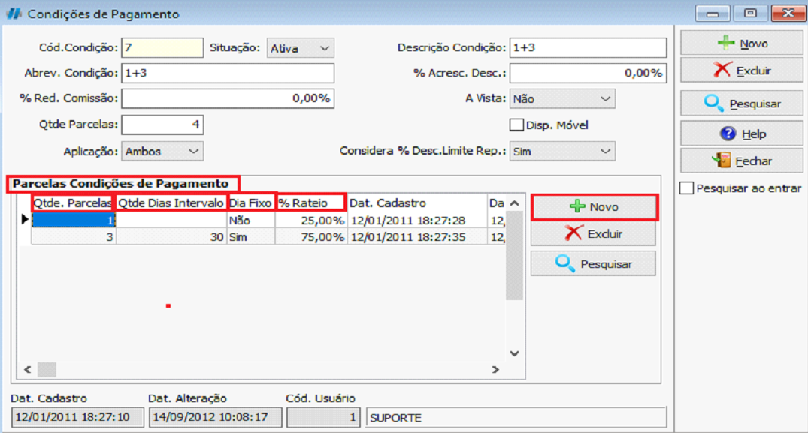

Para conseguir criar uma Condição de Pagamento devemos ir no caminho:  <highlight bgColor="#54638c">Cadastro > Comercial > Condições de Pagamento</highlight>. [Não encontrei esse menu](/docs/intro/comecando#não-encontrei-o-menu-desejado)

:::tip
Ao criar uma Condição de Pagamento pesquisar uma condição semelhante a que queremos já criada e tomarmos ela por base para a criação de uma nova condição.
:::

Dentro do cadastro de Condição de Pagamento devemos clicar no botão `Novo` e começar a preencher as informações.

- **Abrev. Condição:** abreviação da condição de pagamento;  **Ex:** <colorText>1+3</colorText>
- **Qtde Parcelas:** quantidade de parcelas totais;
- **Descrição condição:** Campo para ativar ou inativar um Tipo de Título;  **Ex:** <colorText>1+3</colorText>
- **% Acresc. Desc.:** no caso de obter acréscimo ou desconto nas parcelas;
- **A vista:** define se será a vista;  **Ex:** <colorText>Sim ou Não</colorText>

Após preencher todos os campos, basta clicar em `Salvar` para registrar a Condição de Pagamento.

## Parcelas condições de Pagamento

Na mesma tela, usaremos aba **parcelas condições de pagamento**, onde o usuário informará as parcelas de acordo com a condição cadastrada, clicando em `Novo` para cadastrar.

No exemplo a baixo o usuário optou por cadastrar 1+3. A quantidade de parcelas a serem cadastra será 1 parcela, sem dias de intervalos, de 25% de entrada, as outras 3 parcelas será de 30 dias 75%.

:::warning
Devemos tomar cuidado ao vincularmos uma condição de pagamento e não nos atentarmos a operação utilizada. Uma operação sem configuração desejada pode não gerar dados de caixa ou financeiros.
:::
