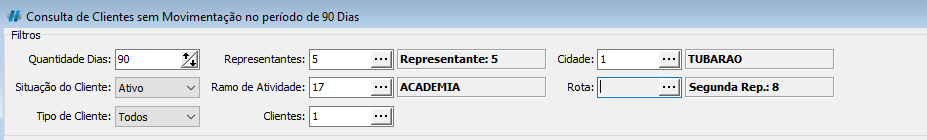
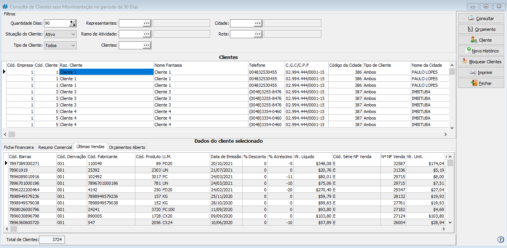
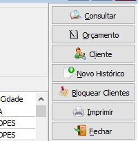

import Tabs from '@theme/Tabs';
import TabItem from '@theme/TabItem';

:::caution
Normalmente o menu para essa consulta vem desabilitado por padrão no sistema para os usuários. Caso não encontre esse menu consulte o que fazer em [Não encontrei esse menu](/docs/intro/comecando#não-encontrei-o-menu-desejado)
:::

Para consultar os clientes sem movimentos devemos ir no caminho:  <highlight bgColor="#54638c">Comercial > Consultas > Consultas Clientes sem Movimentos</highlight>. [Não encontrei esse menu](/docs/intro/comecando#não-encontrei-o-menu-desejado)

## Como utilizar o relatório?

Os campos presentes na tela não são obrigatórios e servem apenas para filtrar e especificar a pesquisa

Podemos preencher os seguintes campos:

- **Quantidade de Dias:** filtra pela quantidade de dias sem movimentações;
- **Situação do Cliente:** filtra por clientes **ATIVOS**, **INATIVOS** e **TODOS**;
- **Tipo de Cliente:** filtra pelos tipos **CLIENTE**, **FORNECEDOR**, **AMBOS** e **TODOS**;
- **Representantes:** filtra os clientes pelo representante informado no cadastro de clientes/fornecedores;
- **Ramos de atividade:** filtra os clientes pelo ramo de atividade informado no cadastro de clientes/fornecedores;
- **Clientes:** filtra por cliente(s) específico;
- **Cidade:** filtra os clientes pela cidade informada no cadastro de clientes/fornecedores;
- **Rota:** filtra os clientes pela rota informada no cadastro de clientes/fornecedores;

Após preencher as informações desejadas, basta clicar em `Consultar`

## Quais informações consigo obter?

A quantidade de registros obtidos na pesquisa aparece no rodapé da tela

A primeira informação que podemos notar seria a lista de clientes que não tiveram movimentações no periodo e que obedecem o filtro feito préviamente

Abaixo existem 4 abas que apresentarão as informações do cliente selecionado

<Tabs>
  <TabItem value="ficha-financeira" label="Ficha Financeira">
    Mostra todos os títulos do cliente, em que:
    <ul>
      <li>
        <colorText color="#f24f46">Vermelhos</colorText> são títulos liquidados
        em atraso;
      </li>
      <li>
        <colorText color="#87db7b">Verde</colorText> são títulos liquidados
        dentro do prazo;
      </li>
    </ul>
  </TabItem>
  <TabItem value="resumo-comercial" label="Resumo Comercial">
    Mostra uma série de informações relevantes aos dados comerciais do cliente
    são elas:
    <ul>
      <li>Data da última compra;</li>
      <li>Valor da última compra;</li>
      <li>Data da maior compra;</li>
      <li>Valor da maior compra;</li>
      <li>Quantidade de compras;</li>
      <li>Quantidade de títulos em Aberto;</li>
      <li>Quantidade de títulos em Atraso;</li>
      <li>Maior Atraso;</li>
      <li>Média de dias de Atraso;</li>
      <li>Data Registro SPC;</li>
      <li>Data Regularização do título;</li>
      <li>Data Limite de Crédito;</li>
      <li>Limite de Crédito;</li>
      <li>Limite usado;</li>
      <li>Limite Disponível;</li>
    </ul>
  </TabItem>
  <TabItem value="ultimas-vendas" label="Últimas Vendas">
    Mostra as últimas vendas para esse Cliente
  </TabItem>
  <TabItem value="orcamento-abertos" label="Orçamentos Abertos">
    Mostra os orçamentos em aberto para esse Cliente
  </TabItem>
</Tabs>

## Outras ações

Além da consulta, previamente explicada, dos clientes sem movimentos, essa tela nos permite outras ações, acessadas pelos botões do direito da tela:

- **Orçamento:** gera um orçamento para o cliente selecionado;
- **Clientes:** consulta o Cliente selecionado;
- **Novo Histórico:** cadastra novo histórico no cadastro do cliente;
- **Bloquear Cliente:** bloqueia o cliente selecionado;
- **Imprimir:** imprime relatórios caso tenha algum configurado;

