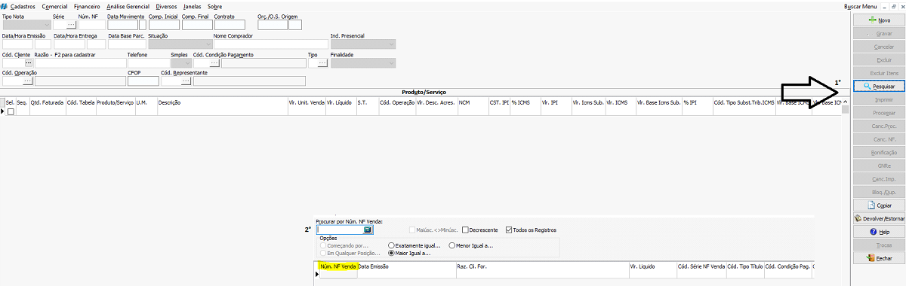
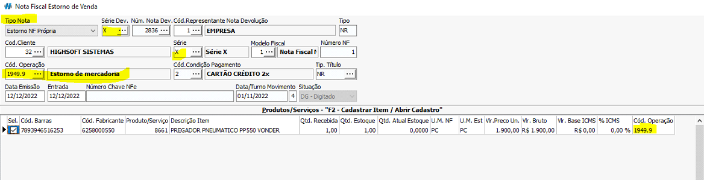
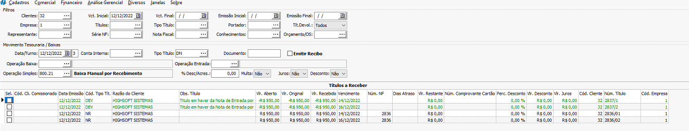

## Objetivo e Função

- Retornar o item ao depósito e gerar crédito de venda/abatimento ao cliente;
- Anular os Impostos pagos no ato da Venda;

## Nota de Venda

:::caution
Para emitir devolução, a situação da nota precisa estar processada
:::

Abrir a tela de notas fiscais de venda em movimentos no caminho   <highlight bgColor="#54638c">Comercial > vendas > Notas Fiscais venda > Movimentos</highlight>. [Não encontrei esse menu](/docs/intro/comecando#não-encontrei-o-menu-desejado)

Clique em `Pesquisar` e pesquise pela nota que você deseja estornar

Após selecionar a nota, clique na opção `Devolver/Estornar` presente no menu direito

## Estorno de Venda

Ao ser direcionado a tela de devolução de nota de venda, se atente à **Tipo da Nota**, **Série**, **Código de Operação** e **Valor**

:::caution
Por padrão, ao clicar no `Devolver/Estornar`, o tipo da nota vem como **DEVOLUÇÃO PRÓPRIA**, Alterar para **ESTORNO NF PRÓPRIA**.
:::

### Série

- Se a venda foi feita em série E, Estorno Própria em série E;
- Se a venda foi feita em série C, Estorno em série E;
- Se a venda for feita em Série X, Estorno em Série X;
- Se a venda for feita em Série CF1, Estorno em Série E;
- Se a venda for feita em Série 0, Estorno em Série 0.

### Código de Operação

:::tip
Será usado CFOP x949.9. **Substituir o x por 1 ou 2 quando a nota for para dentro ou fora do estado Origem respectivamente**. Em caso de dúvidas consultar contador
:::

_<colorText>Caso não aja código de operação configurado, solicitar auxílio suporte</colorText>_

Caso a estorno seja parcial, **DELETAR** os itens que **NÃO VÃO SER ESTORNADOS**. Para isso, clique em cima do item e tecle CTRL + DELETE

Caso deseje deletar Itens em Lote (vários por vez), deixe selecionado os itens que **NÃO serão devolvidos**, e clique no campo `Excluir Itens`

Após isso, basta clicar em `Gravar`

### Movimentação

A nota de estorno, pode ou não gerar um Crédito para abatimento Financeiro.

Por padrão, a nota de estorno movimenta apenas estoque, caso queira que movimente financeiro, o suporte deve ser acionado para ajuste.

### Consulta

Após emitir a nota de estorno própria, ela poderá ser encontrada na tela de consulta de notas de venda, ajustando o filtro `Tipo NF` para **Devolução/Ajuste Devolução**

