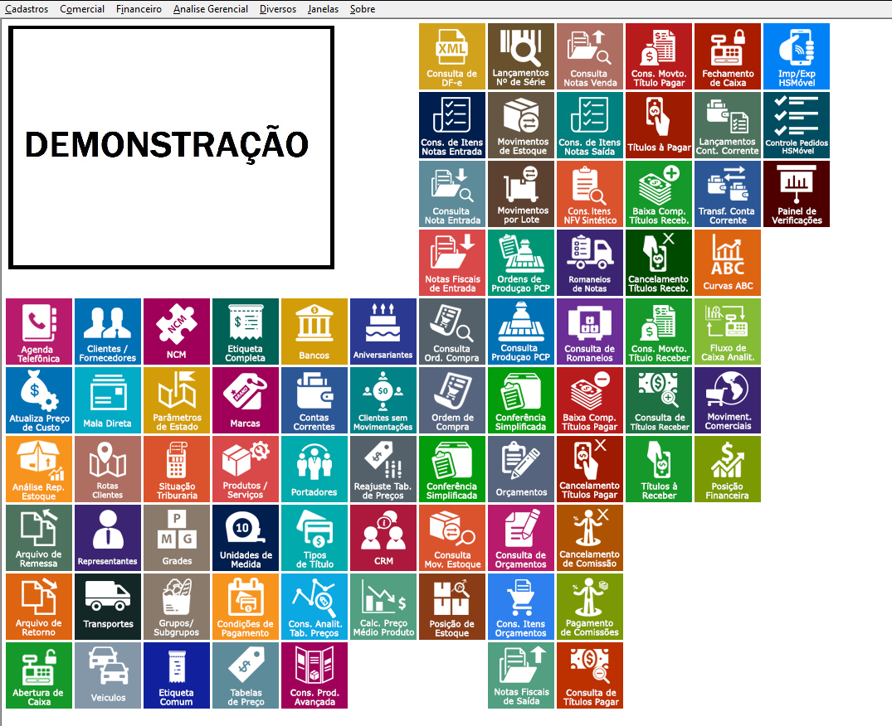

Ter a facilidade de encontrar uma funcionalidade de um sistema é essencial para aumentar a produtividade do time, no HSCorp você pode definir e personalizar menus na sua área de trabalho, facilitando a navegação no Sistema.

Você pode encontrar o _Estilo da Área de Trabalho_ em <highlight bgColor="#54638c">Diversos > Estilo da Área de Trabalho</highlight> e personalizar da forma que preferir.

:::tip
Recomendamos adicionar nessa area de trabalho personalizada os menus mais acessados pelo usuário.

Você pode **consultar** mais informações de como cadastrar seus menus em _**[Icones da área de trabalho](/docs/geral/customizacao/icones-do-desktop)**_
:::

