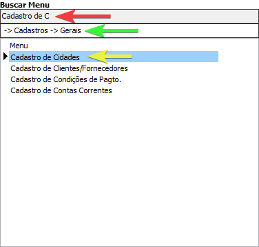

Levando em consideração a idéia de querer aumentar a produtividade, facilidade e intuitividade para o clientes, o HSCorp possui um campo para pesquisar menus.

Você pode acessar esse menu com o atalho <highlight bgColor="#2b99ff">Shift + F3</highlight> do seu teclado.

Esse menu serve para ter acesso à um menu que você ja sabe o nome de forma mais rapida e prática.

