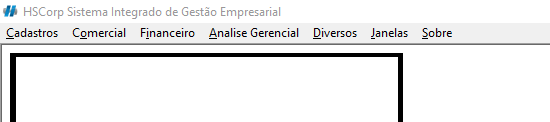
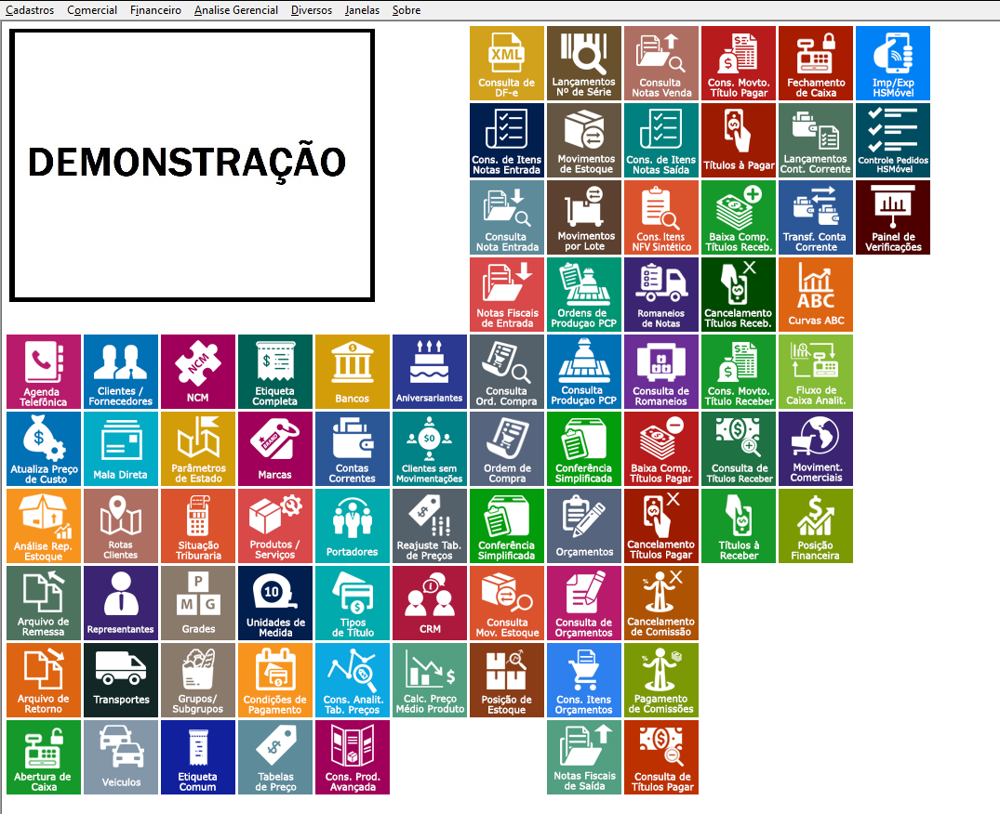
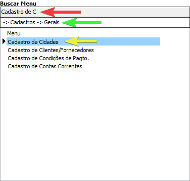

## Login

## Navegação

### Menus

Encontrar as funcionalidade do sistemas é essencial para usufruir de todo conteúdo disponível para você, e no HSCorp não é diferente, você pode navegar nos menus para encontrar todas as funcionalidades. Nosso menu se encontra na parte superior do sistema:

Os menus são distribuidos e abertos conforme você passa o cursor por cima, apresentam um título breve da funcionalidade, que se selecionado abrirá a tela em questão.

Imagine que você deseja encontrar o menu de [Cadastro de Cidades](../cadastro/cidade), você deve seguir a lógica de: <highlight bgColor="#54638c">Cadastro > Gerais > Cidades</highlight>.

:::tip

Você **não** precisa decorar todos os caminhos do menu. Existe um _**[atalho](#atalhos)**_ para a pesquisa dos mesmos.

:::

### Area de trabalho personalizada

Ter a facilidade de encontrar uma funcionalidade de um sistema é essencial para aumentar a produtividade do time, no HSCorp você pode definir e personalizar menus na sua área de trabalho, facilitando a navegação no Sistema.

Você pode encontrar o _Estilo da Área de Trabalho_ em <highlight bgColor="#54638c">Diversos > Estilo da Área de Trabalho</highlight> e personalizar da forma que preferir.

:::tip
Recomendamos adicionar nessa area de trabalho personalizada os menus mais acessados pelo usuário.

Você pode **consultar** mais informações de como cadastrar seus menus em _**[Icones da área de trabalho](../geral/customizacao/icones-do-desktop)**_
:::

### Atalhos

Levando em consideração a idéia de querer aumentar a produtividade, facilidade e intuitividade para o clientes, o HSCorp possui um campo para pesquisar menus.

Você pode acessar esse menu com o atalho <highlight bgColor="#2b99ff">Shift + F3</highlight> do seu teclado.

Esse menu serve para ter acesso à um menu que você ja sabe o nome de forma mais rapida e prática.

Após selecionar o menu desejado, basta clicar sobre ou teclar **Enter**

### Não encontrei o menu desejado

Certifique-se de que foi no caminho correto do menu e tente procurar o Menu utilizando os [atalhos](#atalhos)

Caso não encontre mesmo assim, entre em contato no numero [48 3626-6689](https://wa.me/554836266689?text=Ola%2C+gostaria+de+falar+com+o+Suporte+para+ver+sobre+meus+menus+do+HSCorp), pois o menu pode não estar habilitado para seu usuário.

## Atalhos do Sistema

Atalhos são funcionalidades que aumentam a produtividade do time gera um fluxo mais rápido e prático para empresa. Visando isso, a Highsoft desenvolveu para o HSCorp atalhos para as principais funcionalidade dos sistema.

  
Atalhos do HSCorp

  Caso algum atalho não esteja em funcionamento para seu usuário, entre em contato
  conosco.
  

    

      <shortcut>F4</shortcut> Abre a tela de{' '}
      <a href="#">Movimentos Comerciais</a>
    

    

      <shortcut bgColor="#2b99ff">F5</shortcut> Abre a tela de{' '}
      <a href="#">Autorização Virtual Orçamentos</a>
    

    

      <shortcut bgColor="#2b99ff">Ctrl + P</shortcut> Abre a tela de{' '}
      <a href="#">Produto</a>
    

    

      <shortcut bgColor="#2b99ff">Ctrl + O</shortcut> Abre a tela de{' '}
      <a href="#">Orçamento</a>
    

    

      <shortcut bgColor="#2b99ff">Ctrl + S</shortcut> Abre a tela de{' '}
      <a href="#">Ordem de Serviço</a>
    

    

      <shortcut bgColor="#2b99ff">Ctrl + L</shortcut> Abre a tela de{' '}
      <a href="#">Cliente</a>
    

    

      <shortcut bgColor="#2b99ff">Ctrl + N</shortcut> Abre a tela de{' '}
      <a href="#">Nota de Saída</a>
    

    

      <shortcut bgColor="#2b99ff">Ctrl + E</shortcut> Abre a tela de{' '}
      <a href="#">Nota de Entrada</a>
    

    

      <shortcut bgColor="#2b99ff">Ctrl + T</shortcut> Abre a tela de{' '}
      <a href="#">Tabela de Preço</a>
    

    

      <shortcut bgColor="#2b99ff">Ctrl + R</shortcut> Abre a tela de{' '}
      <a href="#">Romaneio</a>
    

    

      <shortcut bgColor="#2b99ff">Ctrl + Alt + C</shortcut> Abre a tela de{' '}
      <a href="#">CRM - Gestão de relacionamento com o cliente</a>
    

  

