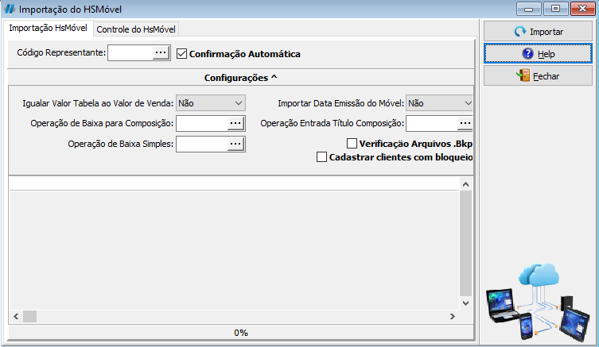

Importação de pedidos é a ação de trazer orçamentos de fora do ERP para dentro dele.

A Highsoft disponibiliza a importação de pedidos do HSMovel e de Sites, caso configurado, para dentro do HSCorp. Isso possibilita o controle de estoque e vendas pelo próprio sistema.

## Como importo meu pedido?

Para importar um pedido, você deve ir no caminho <highlight bgColor="#54638c">Diversos > Exportação Importação > Importação do HsMovel</highlight>.   [Não encontrei esse menu](../intro/getting-started#não-encontrei-o-menu-desejado)

:::info
Caso o pedido seja do site, certifique-se de que o pedido se encontra pago na plataforma.
:::

Abrindo a tela de Importação, você pode selecionar um `Código Representante` especifico para importar pedidos vinculados a ele, ou apenas deixar o campo vazio para importar pedidos de todos os representantes. Por fim, basta clicar em **Importar**. O processo de importação será exibido na tela.

### Avisos

Diversos avisos serão disparados durante a importação dos pedidos para confirmação do que está sendo feito. Você pode automatizar isso selecionando a opção `Confirmação Automatica`, e então irá aparecer somente os avisos improtantes, e não mais confirmações.

Alguns avisos poderão ser exibidos durante a improtação do pedido, fique atento nas mensagens, elas indicam o processo da importação e a situação.

Elas podem dar informações necessárias e cruciais sobre os produtos comprados, o cliente que comprou, entre outras...

Fique atento para uma possivel mensagem de erro tambem, e caso ocorra, tire um print do erro e entre em contato conosco para auxiliar-mos e identificar o problema. Normalmente uma mensagem de erro de sistema vem em uma mensagem em vermelho.

:::info
Saiba mais: [**O que fazer com Avisos no HSCorp?**](../utils/handle-messages)
:::

<!-- Mensagens comuns:
- Produto do orçamento não se encontra mais em estoque
- Cliente -->

### Meu pedido não esta importando

Caso seu pedido não esteja importando, verifique se o sistema não esta emitindo algum alerta de aviso ou de erro para o mesmo, caso esteja e o aviso seja claro e entendivel, verifique as soluções com base na mensagem do aviso.

Temos a explicação de diversos avisos do HSCorp em [O que fazer com Avisos no HSCorp?](../utils/handle-messages#como-tirar-um-screenshot)
