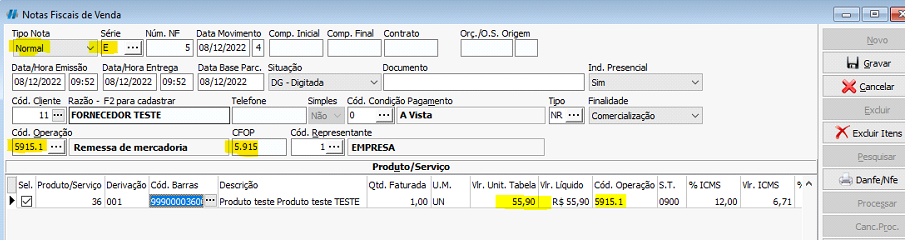
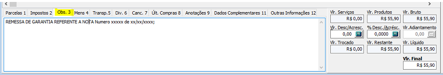
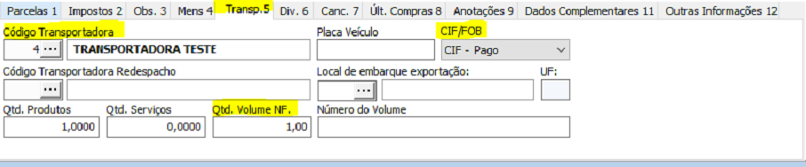
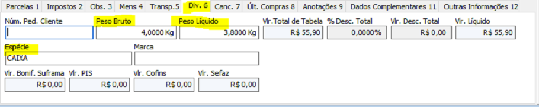

## Como fazer uma nota de simples remessa?

:::info
O **_x_** presente no código de operação durante a documentação a seguir indica se a nota é feita para dentro ou fora do estado.
:::

**Exemplo emissão nota de Remessa de garantia, no qual a peça veio do fornecedor com defeito e a empresa emitirá uma nota de remessa para enviar a peça para conserto.**

Abrir a tela de notas fiscais de saída em movimentos no caminho <highlight bgColor="#54638c">Comercial > Saídas > Notas Fiscais Saída > Movimentos</highlight>.   [Não encontrei esse menu](/docs/intro/comecando#não-encontrei-o-menu-desejado)

### Notas Fiscais de Venda

#### Gerais

Dentro das notas fiscais de saída devemos clicar no botão `Novo` e começar a preencher as informações. Se atente nas seguintes informações para uma nota simples de remessa:

- **Série:** E (Série eletronica);
- **Cód. Operação:** x915.1 (Série eletronica);
- **CFOP:** x915 (Série eletronica);
- Selecionar o item que será enviado na remessa e a quantidade;
- Código de operação deve ser o mesmo do cabeçalho da nota;
- O valor unitário tabela deve ser o valor de custo do item conforme veio na nota de entrada da mercadoria;

_<colorText>Caso necessário destacar ICMS informar a Situação Tributária e a porcentagem ICMS</colorText>_

#### Observações

Na aba 3, nas observações da nota, deve ser informado a referência da nota, o número da nota de compra da mercadoria do fornecedor

#### Transporte

Na aba 5, na transportadora da nota, caso haja transportadora deve ser informada

- Selecionar entre as cadastradas, ou cadastrar;
- Selecionar o Tipo de frete CIF/FOB;
- **Qtd.Volume NF.:** quantidade de volumes a ser enviados;

:::info FOB e CIF

- **FOB:** quem paga destinatário da nota;
- **CIF:** quem paga vendedor/emissor da nota;

:::

#### Peso

Na aba 6, nos diversos da nota, caso haja peso deve ser informado

- **Peso Bruto:** informar o peso bruto do volume;
- **Peso Líquido:** informar o peso líquido do volume;
- **Espécie:** informar o tipo de volume a ser enviado  **Ex:** <colorText> caixa, pallet, etc...</colorText>

Após informar os dados citados acima, a nota está pronta para ser gravada e processada.
