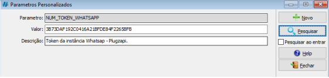
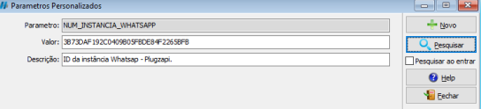
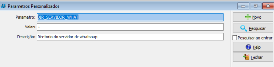
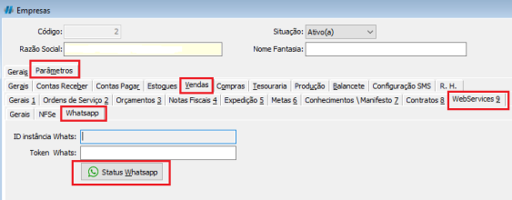
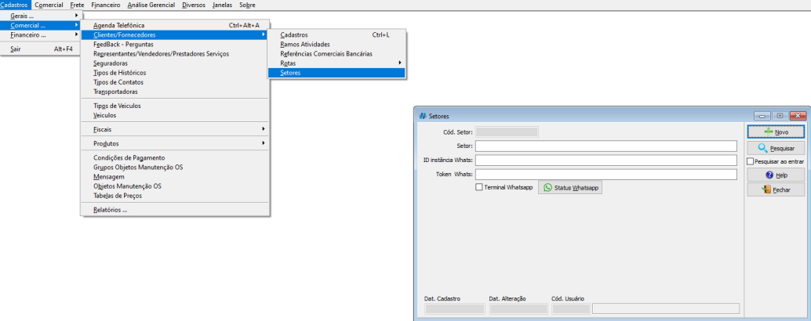
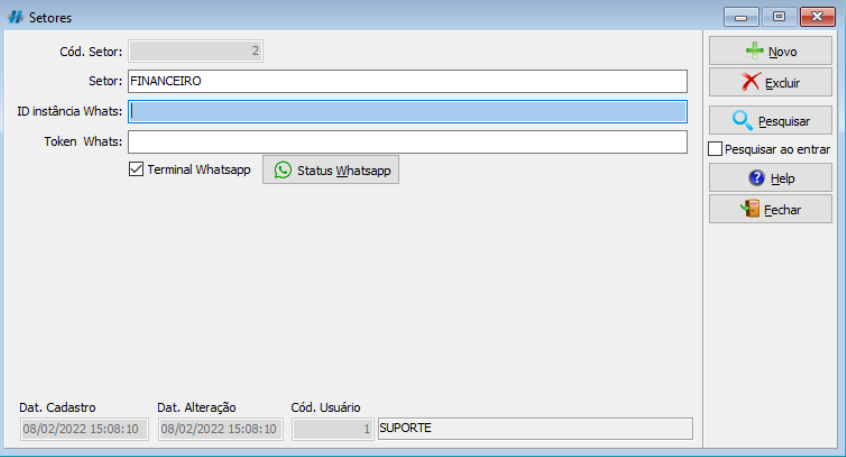

## Objetivo e Função

- Realizar integração entre WhatsApp e sistema HsCorp
- Enviar mensagens comerciais e financeiras
- Otimizar o processo de relacionamento com o cliente

## Ativando o Parâmetro Personalizado

Escolher o número que será utilizado para as operações de WhatsApp no Sistema e repassar para o nosso setor de Comercial.

Irá ser gerado um token e uma instância repassado à você. Após isso, dar continuidade aos seguintes passos:

### Token Whatsapp

Abrir a tela de parâmetros personalizados no caminho <highlight bgColor="#54638c">Cadastro > Gerais > Parâmetros Personalizados</highlight>. [Não encontrei esse menu](/docs/intro/comecando#não-encontrei-o-menu-desejado)

Clique em `Pesquisar` e pesquise por **NUM_TOKEN_WHATSAPP**.

Preencha com o token enviado pelo comercial.

### Instância Whatsapp

Abrir a tela de parâmetros personalizados no caminho <highlight bgColor="#54638c">Cadastro > Gerais > Parâmetros Personalizados</highlight>. [Não encontrei esse menu](/docs/intro/comecando#não-encontrei-o-menu-desejado)

Clique em `Pesquisar` e pesquise por **NUM_INSTANCIA_WHATSAPP**.

Preencha com a instância enviada pelo comercial.

### Servidor Whatsapp

Abrir a tela de parâmetros personalizados no caminho <highlight bgColor="#54638c">Cadastro > Gerais > Parâmetros Personalizados</highlight>. [Não encontrei esse menu](/docs/intro/comecando#não-encontrei-o-menu-desejado)

Clique em `Pesquisar` e pesquise por **DIR_SERVIDOR_WHAT**.

Preencha com o número 1 para ativar.

## Configurando número por empresa

Abrir a tela de parâmetros personalizados no caminho <highlight bgColor="#54638c">Cadastro > Gerais > Empresa</highlight>. [Não encontrei esse menu](/docs/intro/comecando#não-encontrei-o-menu-desejado)

Pesquisar pela empresa logada e selecionar.

Após isso, abra os seguintes menus <highlight bgColor="#54638c">Parâmetros > Vendas > Web Service > WhatsApp</highlight>

Informar os códigos de Id Instância e Token.

Clicar em Status WhatsApp e fazer a leitura QR CODE com aparelho celular que esteja usando o número do token informado.

:::caution
O QR Code precisa ser scaneado em 10 segundos, caso contrário deverá ser gerado um novo clicando em Status WhatsApp
:::

## Configurando número por setor

Caso opte por trabalhar com mais de um número de WhatsApp, a configuração do HsEnvia deve ser feita por setor.

Abrir a tela de setores no caminho <highlight bgColor="#54638c">Cadastro > Comercial > Clientes > Setores</highlight>. [Não encontrei esse menu](/docs/intro/comecando#não-encontrei-o-menu-desejado)

Pesquisar pelo setor desejado e selecionar.

Marcar a opção Terminal WhatsApp

Clicar em `Status WhatsApp` e fazer a leitura QR CODE com aparelho Celular que esteja usando o número do token informado.

:::caution
O QR Code precisa ser scaneado em 10 segundos, caso contrário deverá ser gerado um novo clicando em Status WhatsApp
:::

## Como utilizar

- [Como utilizar o HSEnvia](/faq/como-utilizar-hsenvia)