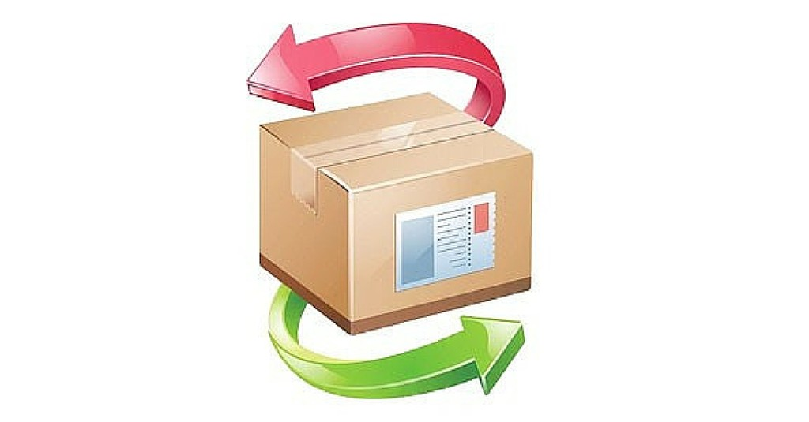
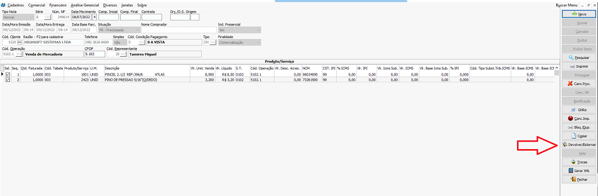
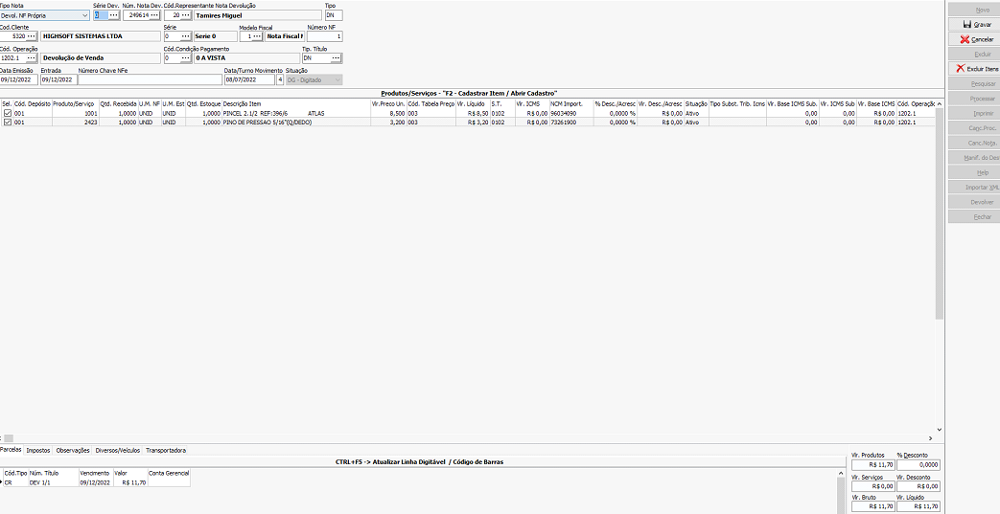
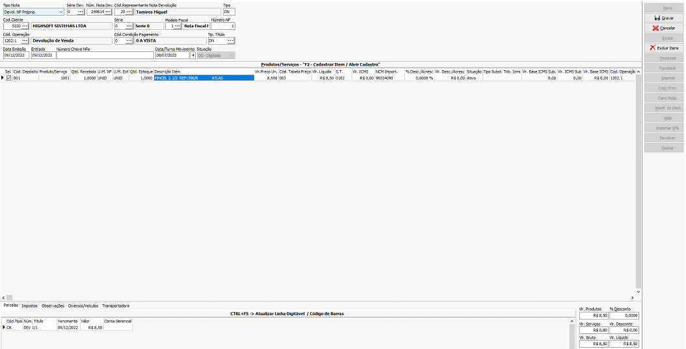
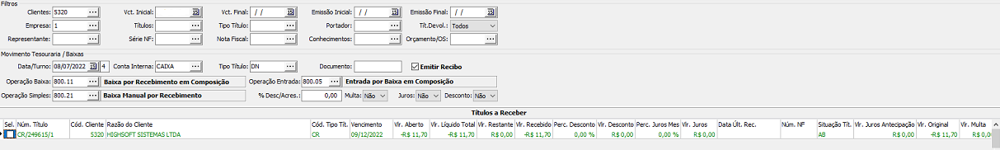
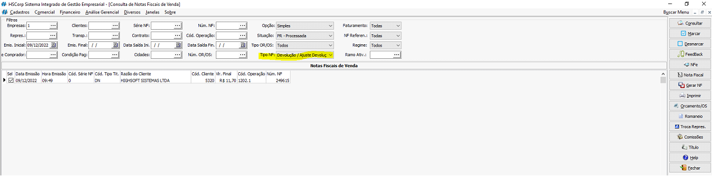

## Objetivo e Função

- Retornar o item ao depósito e gerar crédito de venda/abatimento ao cliente;
- Anular os Impostos pagos no ato da Venda;

## Nota de Venda

:::caution
Para emitir devolução, a situação da nota precisa estar processada
:::

Abrir a tela de notas fiscais de venda em movimentos no caminho   <highlight bgColor="#54638c">Comercial > vendas > Notas Fiscais venda > Movimentos</highlight>. [Não encontrei esse menu](/docs/intro/comecando#não-encontrei-o-menu-desejado)

Clique em `Pesquisar` e pesquise pela nota que você deseja devolver

Após selecionar a nota, clique na opção `Devolver/Estornar` presente no menu direito

## Devolução de Venda - Nota de devolução Própria

Ao ser direcionado a tela de devolução de nota de venda, se atente à **Série**, **Código de Operação** e **Valor**

### Série

- Se a venda foi feita em série E, Devolução Própria em série E;
- Se a venda foi feita em série C, Devolução em série E;
- Se a venda for feita em Série X, Devolução em Série X;
- Se a venda for feita em Série CF1, Devolução em Série E;
- Se a venda for feita em Série 0, Devolução em Série 0.

### Código de Operação

:::tip
Serão usados x 202.1,x 201.1, x 410.1 ou x 411.1. **Substituir o x por 1 ou 2 quando a nota for para dentro ou fora do estado Origem respectivamente**. Em caso de dúvidas consultar contador
:::

Caso a devolução seja parcial, **DELETAR** os itens que **NÃO VÃO SER DEVOLVIDOS**. Para isso, clique em cima do item e tecle CTRL + DELETE

Caso deseje deletar Itens em Lote (vários por vez), deixe selecionado os itens que **NÃO serão devolvidos**, e clique no campo `Excluir Itens`

_<colorText>Exemplo de devolução de nota total</colorText>_

_<colorText>Exemplo de devolução de nota parcial</colorText>_

Após isso, basta clicar em `Gravar`

### Movimentação

Ao gravar uma nota de devolução propria de uma nota de venda, irá ocorrer uma movimentação de entrada dos itens ao depósito, e gerará um crédito no financeiro correspondente ao valor da nota

Esse crédito deverá ser quitado ou deixado para abater em uma próxima venda

### Consulta

Após emitir a nota de devolução própria, ela poderá ser encontrada na tela de consulta de notas de venda, ajustando o filtro `Tipo NF` para **Devolução/Ajuste Devolução**

