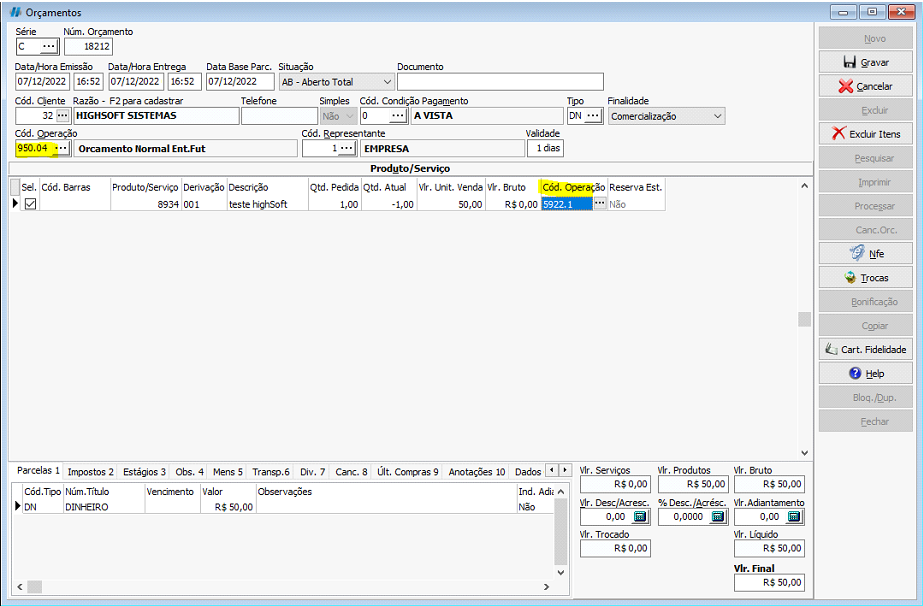
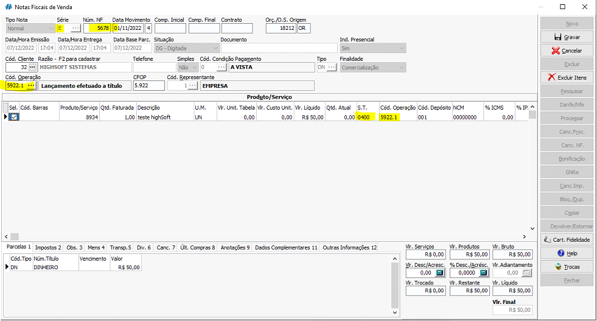
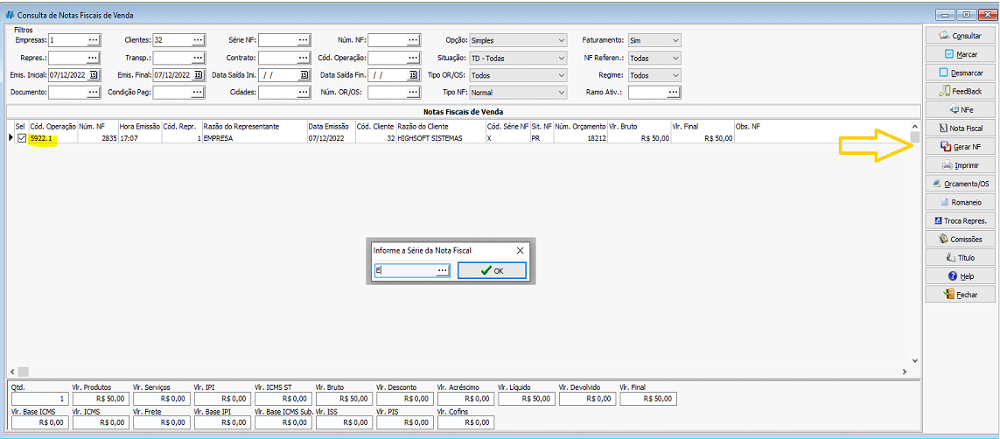

## Objetivo e Função

- Realizar um nota de futura entrega;

### Orçamentos

:::info
O **_x_** presente no código de operação durante a documentação a seguir indica se a nota é feita para dentro ou fora do estado.
:::

Para podermos realizar tal operação, devemos primeiramente ir no orçamento e alterar o `Cód. Operação` do cabeçalho do orçamento para **950.04**.

O código de operação dos itens presentes no orçamento irão trocar automaticamente para um novo **x922.1**, indicando que movimentará apenas o Financeiro, lançando o contas a receber.

Você pode então processar esse orçamento para uma Nota Fiscal de Venda para entrega futura, observando que o código de operação permanece **x922.1**.

_<colorText>A S.T(Situação Tribuitária) da nota pode variar para 041 caso o cliente seja pertencente ao regime tributário Lucro Real/Presumido</colorText>_

Laçamento do título de simples faturamento decorrente de venda para entrega futura foi efetuado.

### Nota de Entrega Futura

Para consultar a nota fiscal de venda entrega futura devemos ir no caminho:   <highlight bgColor="#54638c">Comercial > vendas > Notas Fiscais venda > Consultar > Notas Fiscais venda</highlight>. [Não encontrei esse menu](/docs/intro/comecando#não-encontrei-o-menu-desejado)

Na tela de consulta de notas fiscais de venda, pesquisar a nota emitida na operação **x922.1**,
selecionar a nota, e clicar em `Gerar N.F`

_<colorText>Selecione a série da nota de Entrega Futura, ela deve ser a mesma da nota de Simples Faturamento</colorText>_

Por fim, o código de operação exibido será **x117.1**, indicando que foi efetuado a venda de uma mercadoria adquirida ou recebida de terceiros, originada de encomenda para entrega futura.

Essa nota movimentará o Estoque.;
