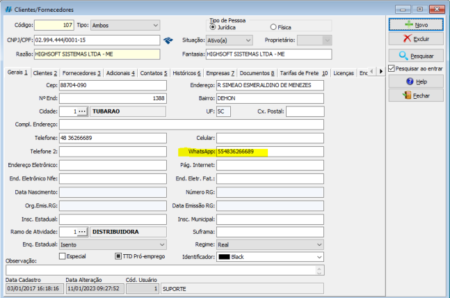

## Objetivo e Função

- Realizar integração entre WhatsApp e sistema HsCorp
- Enviar mensagens comerciais e financeiras
- Otimizar o processo de relacionamento com o cliente

:::caution
Confira [como configurar o Whatsapp](/faq/como-configurar-hsenvia) para sua empresa antes de seguir o tutorial de como utilizar.
:::

## Funcionalidades Gerais

O envio de mensagens por whatsapp está disponível em qualquer uma das telas que possuir o ícone do mesmo.

Lembrando que, o número do WhatsApp do cliente deve constar no cadastro dele para poder chegar as mensagens ao cliente.

## Usando o HSEnvia na tela de Consulta de Notas

Em telas de consulta, é possivel selecionar vários clientes para enviar uma mensagem.

- Pesquisar as notas
- Marcar as notas
- Clicar em WhatsApp
- Clicar em Alterar as mensagens
- Escolher o Cód. Mensagem, ou digitar a mensagem no campo
- Clicar em alterar para enviar a mesma mensagem para todos os clientes

Caso a empresa trabalhe com mais de um número WhatsApp, é necessário selecionar o setor.
Caso não tenha Número de WhatsApp no cadastro é necessário preencher `Num. WhatsApp`, pois o mesmo virá em branco.

Se desejar enviar um anexo a todos os clientes listados, poderá clicar no campo anexo para incluir uma imagem ou documento que será enviado a cada número que estiver listado.

:::info
Dependendo da quantidade de mensagens e do tamanho do anexo, pode haver uma demora no envio.
:::

## Usando o HSEnvia nas telas de consulta de Orçamento e Ordens de Serviço

Na tela de orçamento, poderá selecionar vários clientes para enviar uma mensagem.

- Consultar um orçamento através dos filtros
- Clicar em WhatsApp
- Clicar em Alterar as mensagens
- Escolher o Cód. Mensagem, ou digitar a mensagem no campo
- Clicar em alterar para enviar a mesma mensagem para o clientes

Caso a empresa trabalhe com mais de um número WhatsApp, é necessário selecionar o setor.
Caso não tenha Número de WhatsApp no cadastro é necessário preencher `Num. WhatsApp`, pois o mesmo virá em branco.

## Usando HSEnvia para envio de danfe/xml

Ao abrir qualquer nota eletrônica, clicar em `DANFE/NFE > Enviar danfe/xml Por WhatsApp`;

- Abrir uma nota eletronica
- Clicar em WhatsApp
- Clicar em Alterar as mensagens
- Escolher o Cód. Mensagem, ou digitar a mensagem no campo
- Clicar em alterar para enviar a mesma mensagem para o clientes

Caso a empresa trabalhe com mais de um número WhatsApp, é necessário selecionar o setor.
Caso não tenha Número de WhatsApp no cadastro é necessário preencher `Num. WhatsApp`, pois o mesmo virá em branco.

## Usando HSEnvia pelo CRM

- Consultar através dos filtros
- Selecionar os clientes
- Clicar em WhatsApp
- Clicar em Alterar as mensagens
- Escolher o Cód. Mensagem, ou digitar a mensagem no campo
- Clicar em alterar para enviar a mesma mensagem para os clientes

Caso a empresa trabalhe com mais de um número WhatsApp, é necessário selecionar o setor.
Caso não tenha Número de WhatsApp no cadastro é necessário preencher `Num. WhatsApp`, pois o mesmo virá em branco.

## Configurando mensagens automáticas

Abrir a tela de mensagens no caminho <highlight bgColor="#54638c">Cadastro > Comercial > Mensagens</highlight>. [Não encontrei esse menu](/docs/intro/comecando#não-encontrei-o-menu-desejado)

Selecionar `Novo` para iniciar um novo cadastro.

Preencher o tipo da mensagem e o conteúdo dela.

Após isso, ela estará disponível para ser utilizada em qualquer um dos locais de envio de mensagens por WhatsApp, basta selecionar o código da mesma no momento do envio.
